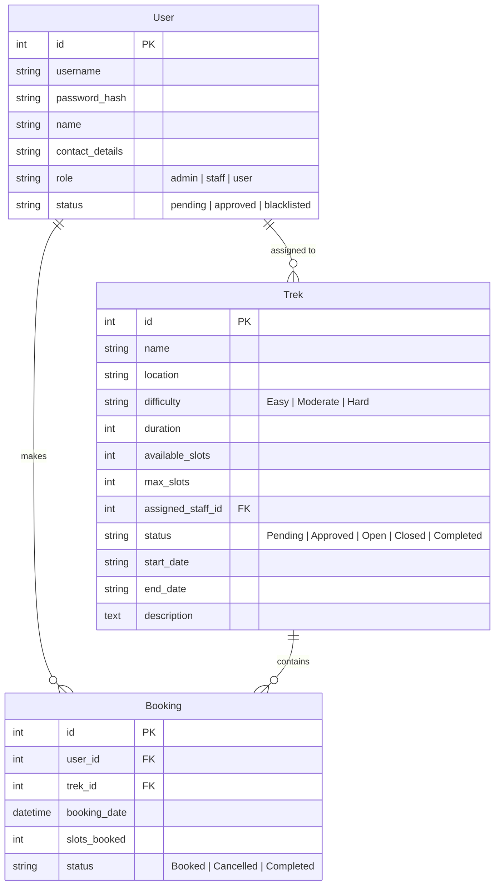

# Trekking Management Application

A web-based Trekking Management System built using **Flask**, **Jinja2 Templating**, **Bootstrap 5**, and **SQLite**. The application facilitates seamless coordination between Adventure Organizers (Admin), Trek Guides (Staff), and Participants (Trekkers).

---

## Table of Contents

1. [Features](#features)
   - [Admin Functionalities](#1-admin-functionalities)
   - [Trek Staff Functionalities](#2-trek-staff-functionalities)
   - [User / Trekker Functionalities](#3-user--trekker-functionalities)
   - [REST API Resources](#4-rest-api-resources)
2. [Technology Stack](#technology-stack)
3. [Project Structure](#project-structure)
4. [Database Schema](#database-schema)
5. [Installation & Setup](#installation--setup)
6. [Default Credentials](#default-credentials)

---

## Features

### 1. Admin Functionalities
* **Dashboard Overview**: Metrics displaying total treks, users, staff members, and total bookings, along with recent booking logs.
* **Trek Management**: Create, edit, search, and delete trek routes. Set location, difficulty level, duration, dates, and slot capacity.
* **Staff Approval & Control**: Review self-registered staff members. Approve, reject, or blacklist staff accounts. Assign staff members to specific treks.
* **User Management**: View registered trekkers and manage user active/blacklisted statuses.
* **Global Search**: Search across treks, users, and staff by Name, Location, Username, or ID.
* **Analytics Reports**: View booking breakdowns by status, difficulty distribution, and top popular treks.

### 2. Trek Staff Functionalities
* **Self-Registration**: Register as staff (requires Admin approval to access the staff panel).
* **Assigned Treks Panel**: View assigned treks and total participant counts.
* **Trek Progress & Slots**: Update available slots and toggle trek status (`Open`, `Closed`, `Completed`).
* **Participant Manifest**: View participant lists and contact details for assigned treks.
* **Quick Actions**: Mark treks as **Started** or **Completed**.

### 3. User / Trekker Functionalities
* **Registration & Authentication**: Self-register and log in.
* **Browse & Filter Treks**: Filter open treks by difficulty level (`Easy`, `Moderate`, `Hard`) and location.
* **Trek Details & Booking**: Inspect trek routes, dates, guide info, and book available slots. Overbooking prevention logic ensures capacity limits are respected.
* **My Bookings**: View active upcoming bookings with cancellation support.
* **Trekking History**: View completed and cancelled trek records.
* **Profile Management**: Update personal name and contact details.

### 4. REST API Resources
* `GET /api/treks`: JSON list of open treks.
* `GET /api/users`: JSON list of users (Admin only).
* `GET /api/bookings`: JSON list of all bookings (Admin and Staff only).

---

## Technology Stack

* **Backend Framework**: Python 3, Flask
* **Database & ORM**: SQLite, Flask-SQLAlchemy
* **Security & Auth**: Werkzeug (`generate_password_hash`, `check_password_hash`), Session-based RBAC
* **Frontend**: HTML5, Jinja2 Templates, Bootstrap 5, Bootstrap Icons
* **Custom Styling**: Basic CSS (`static/css/custom.css`)

---

## Project Structure

```text
trekking_management_app/
│
├── app.py                      # Main entry point, configuration, & database initialization
├── models.py                   # SQLAlchemy models (User, Trek, Booking)
├── static/
│   └── css/
│       └── custom.css          # Styling rules
├── templates/
│   ├── base.html               # Main scaffold layout & Bootstrap navbar
│   ├── login.html              # Authentication login view
│   ├── register.html           # User & Staff registration view
│   ├── admin_dashboard.html    # Admin metrics & recent activity
│   ├── admin_treks.html        # Trek management & modal forms
│   ├── admin_staff.html        # Staff request approval tabs
│   ├── admin_users.html        # User list & blacklisting
│   ├── admin_bookings.html     # Global booking records
│   ├── admin_search.html       # Global search page
│   ├── admin_reports.html      # Analytical summaries
│   ├── staff_dashboard.html    # Staff assigned treks & metrics
│   ├── staff_trek_detail.html  # Staff trek detail & participant manifest
│   ├── staff_participants.html # Aggregated participants list
│   ├── staff_profile.html      # Staff profile editor
│   ├── user_dashboard.html     # User welcome, filters & trek catalog
│   ├── user_trek_detail.html   # Trek details & booking form
│   ├── user_bookings.html      # User active bookings list
│   ├── user_history.html       # Completed/cancelled trek history
│   └── user_profile.html       # Trekker profile editor
└── blueprints/
    ├── admin.py                # Admin routes & business logic
    ├── api.py                  # JSON API endpoints
    ├── auth.py                 # Login, registration, & logout logic
    ├── staff.py                # Staff dashboard & management routes
    └── user.py                 # Trekker routes & booking workflows
```

---

## Database Schema



---

## Installation & Setup

1. **Clone or Navigate to the Project Directory**:
   ```bash
   cd Trekking-Management-App
   ```

2. **(Optional) Create and Activate a Virtual Environment**:
   * **Windows (PowerShell)**:
     ```powershell
     python -m venv .venv
     .\.venv\Scripts\Activate.ps1
     ```
   * **Linux / macOS**:
     ```bash
     python3 -m venv .venv
     source .venv/bin/activate
     ```

3. **Install Dependencies**:
   ```bash
   pip install flask flask-sqlalchemy
   ```

4. **Run the Application**:
   ```bash
   python app.py
   ```

5. **Access in Browser**:
   Open [http://127.0.0.1:5000](http://127.0.0.1:5000) in your web browser.

---

## Default Credentials

The application programmatically creates the database and populates initial seed data on first boot:

* **Admin Account**:
  * **Username**: `admin`
  * **Password**: `admin123`
* **Staff & User Accounts**:
  * Can be self-registered via the `/register` route.

##  Author

**Utpal Kumar**

BS in Data Science and Applications  
Indian Institute of Technology Madras
